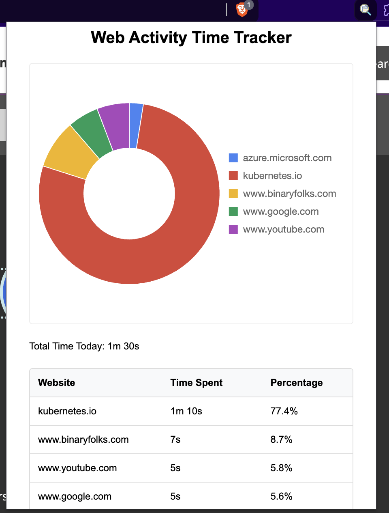

# Web Activity Time Tracker

A Chrome extension that tracks and visualizes the time spent on different websites.

## Features

- Real-time tracking of website visits
- Visual representation with pie chart
- Detailed breakdown of time spent per website
- Percentage calculation of total browsing time
- Automatic updates every 5 seconds
- Clean and intuitive user interface

## Screenshots


*Main interface showing website tracking statistics and Detailed breakdown of time spent on different websites*

## Installation
1. Clone this repository:
```bash
git clone https://github.com/yourusername/web-activity-time-tracker.git
```
2. Open Chrome and navigate to chrome://extensions/
3. Enable "Developer mode" in the top right corner
4. Click "Load unpacked" and select the extension directory

## Usage
1. After installation, the extension icon will appear in your Chrome toolbar
2. Click the icon to view your web activity statistics
3. The popup will show:
   - Total time spent today
   - Pie chart of website distribution
   - Detailed list of websites with time spent and percentages

## Files Structure
```plaintext
web-activity-time-tracker/
├── manifest.json        # Extension configuration
├── background.js       # Background tracking logic
├── popup.html         # Popup interface
├── popup.js          # Popup functionality
├── popup.css         # Styles for popup
├── chart.js         # Chart.js library
└── icons/           # Extension icons
```

## Dependencies
- Chart.js (included locally for visualization)

## Contributing
1. Fork the repository
2. Create your feature branch ( git checkout -b feature/amazing-feature )
3. Commit your changes ( git commit -m 'Add some amazing feature' )
4. Push to the branch ( git push origin feature/amazing-feature )
5. Open a Pull Request

## License
This project is licensed under the MIT License - see the LICENSE file for details.